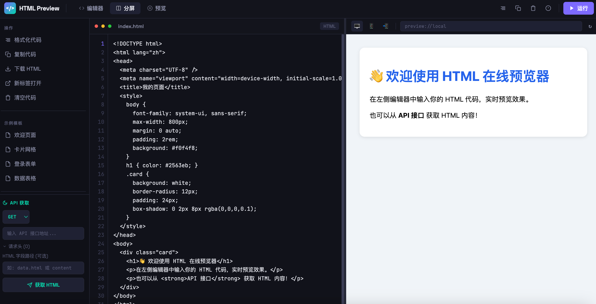

# HTML 在线预览器

基于 Vue 3 + Vite 的 HTML 代码在线编辑和预览工具。



## 功能特性

- **实时预览**: 编辑 HTML 代码，自动预览效果（600ms 防抖）
- **分屏模式**: 支持编辑器/分屏/预览三种视图模式
- **设备模拟**: 桌面/平板/手机三种设备预览模式
- **API 获取**: 从任意 API 接口获取 HTML 内容
- **XLab 集成**: 支持通过 `?xlab=<id>` 加载 XLab 文章
- **示例模板**: 内置多个 HTML/CSS 示例模板

## 快速开始

### 安装依赖

```bash
npm install
```

### 开发模式

```bash
npm run dev
```

访问 http://localhost:5173

### 构建生产版本

```bash
npm run build
```

### 预览构建结果

```bash
npm run preview
```

## 技术栈

- Vue 3 (Composition API)
- Vite
- CSS Variables

## 项目结构

```
src/
├── components/      # Vue 组件
├── composables/     # 组合式函数
└── styles/          # 全局样式
```

## 快捷键

- `Ctrl/Cmd + Enter`: 运行代码
- `Ctrl/Cmd + S`: 下载 HTML 文件
- `Tab`: 缩进（2 空格）
